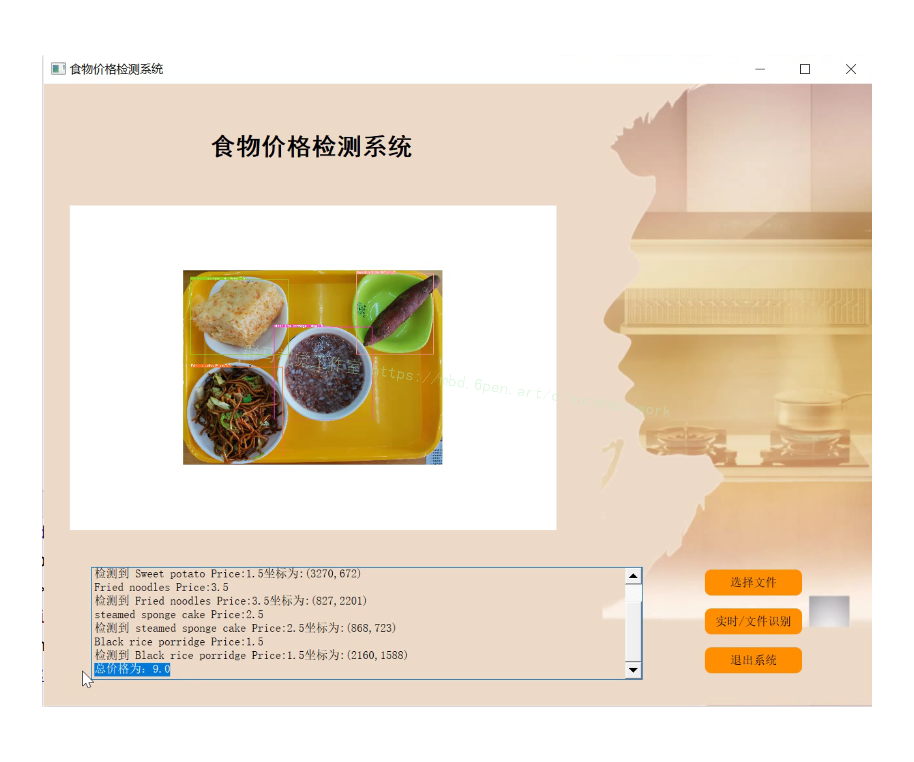
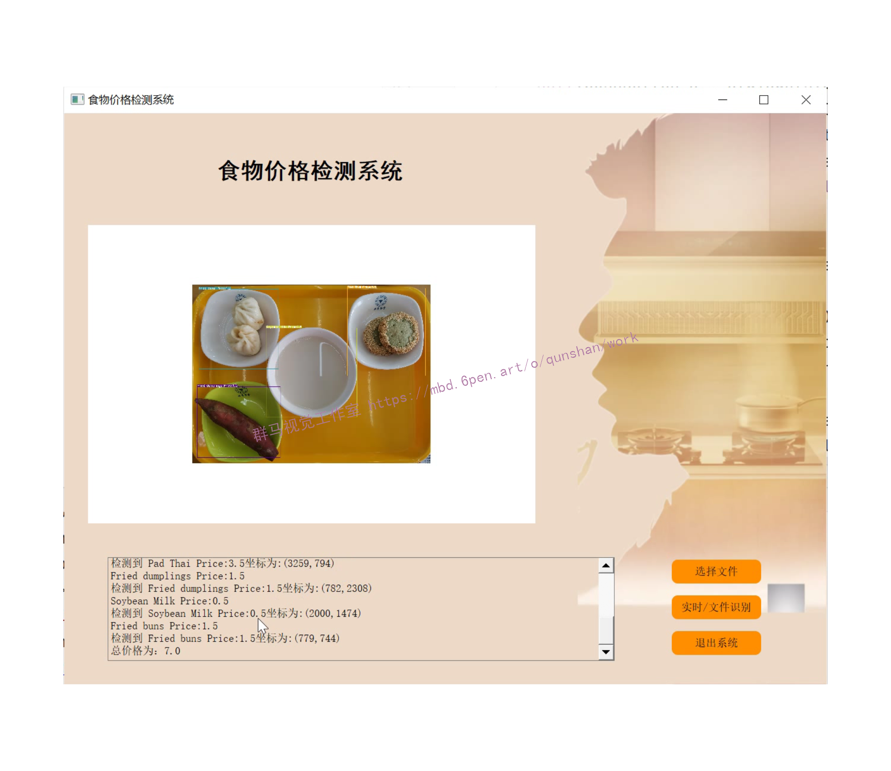
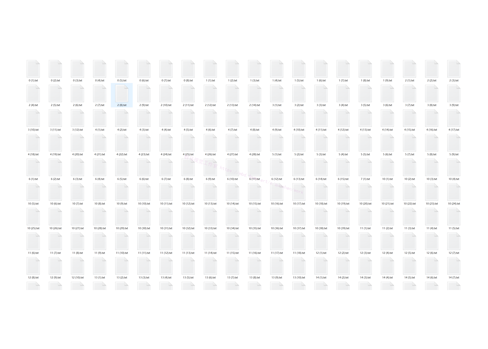
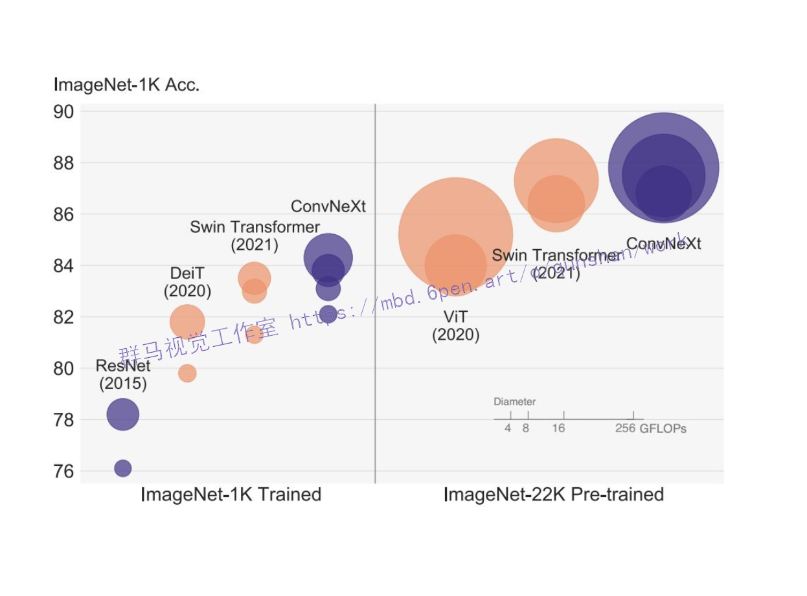
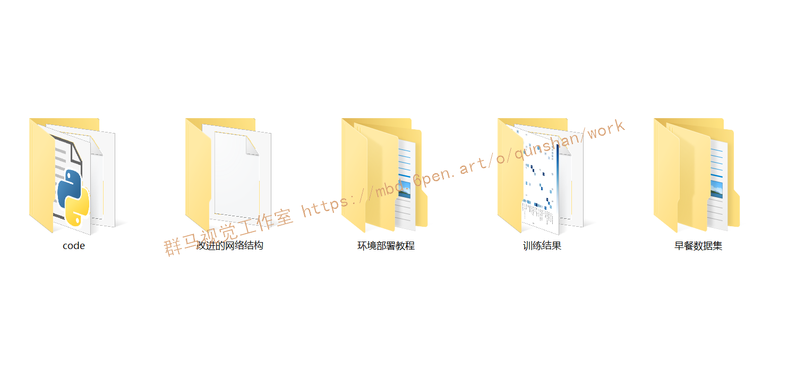

# 1.研究背景
科技的快速发展极大提升人们的日常生活水平，食品自动识别作为计算机视觉领域在真实场景下的重要应用之一是当前的研究热点。食品自动识别不仅能够用于自动计价，增加结算窗口，降低人力资源损耗，有效减少顾客排队等候时间，还可以用于顾客的饮食偏好分析。

# 2.图片演示




# 3.视频演示

[基于改进YOLOv7的早餐价格检测系统（源码＆教程）_哔哩哔哩_bilibili](https://www.bilibili.com/video/BV1h44y1f7sN/?vd_source=bc9aec86d164b67a7004b996143742dc)


# 4.早餐数据集




# 5.YOLOv7 技术方法
近年来，实时目标检测器仍在针对不同的边缘设备进行开发。例如，MCUNet 和 NanoDet 的开发专注于生产低功耗单芯片并提高边缘 CPU 的推理速度；YOLOX、YOLOR 等方法专注于提高各种 GPU 的推理速度；实时目标检测器的发展集中在高效架构的设计上；在 CPU 上使用的实时目标检测器的设计主要基于 MobileNet、ShuffleNet 或 GhostNet；为 GPU 开发的实时目标检测器则大多使用 ResNet、DarkNet 或 DLA，并使用 CSPNet 策略来优化架构。

YOLOv7 的发展方向与当前主流的实时目标检测器不同，研究团队希望它能够同时支持移动 GPU 和从边缘到云端的 GPU 设备。除了架构优化之外，该研究提出的方法还专注于训练过程的优化，将重点放在了一些优化模块和优化方法上。这可能会增加训练成本以提高目标检测的准确性，但不会增加推理成本。研究者将提出的模块和优化方法称为可训练的「bag-of-freebies」。

对于模型重参数化，该研究使用梯度传播路径的概念分析了适用于不同网络层的模型重参数化策略，并提出了有计划的重参数化模型。此外，研究者发现使用动态标签分配技术时，具有多个输出层的模型在训练时会产生新的问题：「如何为不同分支的输出分配动态目标？」针对这个问题，研究者提出了一种新的标签分配方法，称为从粗粒度到细粒度（coarse-to-fine）的引导式标签分配。

## [该研究](https://mbd.pub/o/bread/Y5qVmpds)的主要贡献包括：

(1) 设计了几种可训练的 bag-of-freebies 方法，使得实时目标检测可以在不增加推理成本的情况下大大提高检测精度；

(2) 对于目标检测方法的演进，研究者发现了两个新问题：一是重参数化的模块如何替换原始模块，二是动态标签分配策略如何处理分配给不同输出层的问题，并提出了解决这两个问题的方法； 

(3) 提出了实时目标检测器的「扩充（extend）」和「复合扩展（compound scale）」方法，以有效地利用参数和计算； 

(4) 该研究提出的方法可以有效减少 SOTA 实时目标检测器约 40% 的参数和 50% 的计算量，并具有更快的推理速度和更高的检测精度。

在大多数关于设计高效架构的文献中，人们主要考虑的因素包括参数的数量、计算量和计算密度。下图 2（b）中 CSPVoVNet 的设计是 VoVNet 的变体。CSPVoVNet 的架构分析了梯度路径，以使不同层的权重能够学习更多不同的特征，使推理更快、更准确。图 2 (c) 中的 ELAN 则考虑了「如何设计一个高效网络」的问题。

YOLOv7 研究团队提出了基于 ELAN 的扩展 E-ELAN，其主要架构如图所示。
[图片上传失败...(image-cd2b8-1662899484886)]
新的 E-ELAN 完全没有改变原有架构的梯度传输路径，其中使用组卷积来增加添加特征的基数（cardinality），并以 shuffle 和 merge cardinality 的方式组合不同组的特征。这种操作方式可以增强不同特征图学得的特征，改进参数的使用和计算效率。

无论梯度路径长度和大规模 ELAN 中计算块的堆叠数量如何，它都达到了稳定状态。如果无限堆叠更多的计算块，可能会破坏这种稳定状态，参数利用率会降低。新提出的 E-ELAN 使用 expand、shuffle、merge cardinality 在不破坏原有梯度路径的情况下让网络的学习能力不断增强。

在架构方面，E-ELAN 只改变了计算块的架构，而过渡层（transition layer）的架构完全没有改变。YOLOv7 的策略是使用组卷积来扩展计算块的通道和基数。研究者将对计算层的所有计算块应用相同的组参数和通道乘数。然后，每个计算块计算出的特征图会根据设置的组参数 g 被打乱成 g 个组，再将它们连接在一起。此时，每组特征图的通道数将与原始架构中的通道数相同。最后，该方法添加 g 组特征图来执行 merge cardinality。除了保持原有的 ELAN 设计架构，E-ELAN 还可以引导不同组的计算块学习更多样化的特征。
因此，对基于串联的模型，我们不能单独分析不同的扩展因子，而必须一起考虑。该研究提出图 （c），即在对基于级联的模型进行扩展时，只需要对计算块中的深度进行扩展，其余传输层进行相应的宽度扩展。这种复合扩展方法可以保持模型在初始设计时的特性和最佳结构。

此外，该研究使用梯度流传播路径来分析如何重参数化卷积，以与不同的网络相结合。下图展示了该研究设计的用于 PlainNet 和 ResNet 的「计划重参数化卷积」。
[图片上传失败...(image-fb627b-1662899484886)]

# 6.ConvNeXt 结合 YOLOv7 模型


[该文献设计了一个 CNeB 模块](https://afdian.net/item?plan_id=befadfde58e511ed818552540025c377)，使参数量和计算量均减少。
视觉Transformer的最新进展表明，在基于点积自注意力的新空间建模机制驱动的各种任务中取得了巨大成功。在本文中，作者证明了视觉Transformer背后的关键成分，即输入自适应、长程和高阶空间交互，也可以通过基于卷积的框架有效实现。作者提出了递归门卷积（g n Conv），它用门卷积和递归设计进行高阶空间交互。新操作具有高度灵活性和可定制性，与卷积的各种变体兼容，并将自注意力中的二阶交互扩展到任意阶，而不引入显著的额外计算。g nConv可以作为一个即插即用模块来改进各种视觉Transformer和基于卷积的模型。基于该操作，作者构建了一个新的通用视觉主干族，名为HorNet。在ImageNet分类、COCO对象检测和ADE20K语义分割方面的大量实验表明，HorNet在总体架构和训练配置相似的情况下，优于Swin Transformers和ConvNeXt。HorNet还显示出良好的可扩展性，以获得更多的训练数据和更大的模型尺寸。除了在视觉编码器中的有效性外，作者还表明g n Conv可以应用于任务特定的解码器，并以较少的计算量持续提高密集预测性能。本文的结果表明，g n Conv可以作为一个新的视觉建模基本模块，有效地结合了视觉Transformer和CNN的优点。

# 7.代码实现

```
class LayerNorm_s(nn.Module):
def __init__(self, normalized_shape, eps=1e-6, data_format="channels_last"):
super().__init__()
self.weight = nn.Parameter(torch.ones(normalized_shape))
self.bias = nn.Parameter(torch.zeros(normalized_shape))
self.eps = eps
self.data_format = data_format
if self.data_format not in ["channels_last", "channels_first"]:
raise NotImplementedError
self.normalized_shape = (normalized_shape,)
def forward(self, x):
if self.data_format == "channels_last":
return F.layer_norm(x, self.normalized_shape, self.weight, self.bias, self.eps)
elif self.data_format == "channels_first":
u = x.mean(1, keepdim=True)
s = (x - u).pow(2).mean(1, keepdim=True)
x = (x - u) / torch.sqrt(s + self.eps)
x = self.weight[:, None, None] * x + self.bias[:, None, None]
return x
class ConvNextBlock(nn.Module):
def __init__(self, dim, drop_path=0., layer_scale_init_value=1e-6):
super().__init__()
self.dwconv = nn.Conv2d(dim, dim, kernel_size=7, padding=3, groups=dim) # depthwise conv
self.norm = LayerNorm_s(dim, eps=1e-6)
self.pwconv1 = nn.Linear(dim, 4 * dim)
self.act = nn.GELU()
self.pwconv2 = nn.Linear(4 * dim, dim)
self.gamma = nn.Parameter(layer_scale_init_value * torch.ones((dim)),
requires_grad=True) if layer_scale_init_value > 0 else None
self.drop_path = DropPath(drop_path) if drop_path > 0. else nn.Identity()
def forward(self, x):
input = x
x = self.dwconv(x)
x = x.permute(0, 2, 3, 1) # (N, C, H, W) -> (N, H, W, C)
x = self.norm(x)
x = self.pwconv1(x)
x = self.act(x)
x = self.pwconv2(x)
if self.gamma is not None:
x = self.gamma * x
x = x.permute(0, 3, 1, 2) # (N, H, W, C) -> (N, C, H, W)
x = input + self.drop_path(x)
return x
class DropPath(nn.Module):
"""Drop paths (Stochastic Depth) per sample (when applied in main path of residual blocks). """
def __init__(self, drop_prob=None):
super(DropPath, self).__init__()
self.drop_prob = drop_prob
def forward(self, x):
return drop_path_f(x, self.drop_prob, self.training)
def drop_path_f(x, drop_prob: float = 0., training: bool = False):
if drop_prob == 0. or not training:
return x
keep_prob = 1 - drop_prob
shape = (x.shape[0],) + (1,) * (x.ndim - 1) # work with diff dim tensors, not just 2D ConvNets
random_tensor = keep_prob + torch.rand(shape, dtype=x.dtype, device=x.device)
random_tensor.floor_() # binarize
output = x.div(keep_prob) * random_tensor
return output
class CNeB(nn.Module):
# CSP ConvNextBlock with 3 convolutions by iscyy/yoloair
def __init__(self, c1, c2, n=1, shortcut=True, g=1, e=0.5): # ch_in, ch_out, number, shortcut, groups, expansion
super().__init__()
c_ = int(c2 * e) # hidden channels
self.cv1 = Conv(c1, c_, 1, 1)
self.cv2 = Conv(c1, c_, 1, 1)
self.cv3 = Conv(2 * c_, c2, 1)
self.m = nn.Sequential(*(ConvNextBlock(c_) for _ in range(n)))
def forward(self, x):
return self.cv3(torch.cat((self.m(self.cv1(x)), self.cv2(x)), dim=1))
```

# 8.系统整合
[下图源码＆环境部署视频教程＆数据集＆自定义UI界面](https://s.xiaocichang.com/s/1fada4)



# 10.[参考文献](https://mbd.pub/o/qunma/work)
***
[1]李新叶,龙慎鹏,朱婧.基于深度神经网络的少样本学习综述[J].计算机应用研究.2020,(8).DOI:10.19734/j.issn.1001-3695.2019.03.0036.
[2]张旭东,刘杨,胡康.基于物联网、大数据构建面向人群健康的食品安全追溯新模式[J].中国数字医学.2019,(10).DOI:10.3969/j.issn.1673-7571.2019.10.008.
[3]张钢,张石清.基于DCNN和迁移学习的食物图像识别[J].实验室研究与探索.2019,(6).DOI:10.3969/j.issn.1006-7167.2019.06.028.
[4]刘华祠.基于传统机器学习与深度学习的图像分类算法对比分析[J].电脑与信息技术.2019,(5).DOI:10.3969/j.issn.1005-1228.2019.05.004.
[5]邓长银,张杰.基于改进LeNet-5模型的手写数字识别[J].信息通信.2018,(1).DOI:10.3969/j.issn.1673-1131.2018.01.047.
[6]陈秋瑞,郑世珏,陈辉,等.基于AlphaGo算法的网络媒体不良词汇自动检测模式研究[J].计算机与数字工程.2018,(8).DOI:10.3969/j.issn.1672-9722.2018.08.022.
[7]周俊宇,赵艳明.卷积神经网络在图像分类和目标检测应用综述[J].计算机工程与应用.2017,(13).DOI:10.3778/j.issn.1002-8331.1703-0362.
[8]丁伟利,李勇,陈瑜.基于区域颜色特征的食物类别识别算法[J].电子科技.2016,(6).DOI:10.16180/j.cnki.issn1007-7820.2016.06.001.
[9]彭天强,栗芳.基于深度卷积神经网络和二进制哈希学习的图像检索方法[J].电子与信息学报.2016,(8).DOI:10.11999/JEIT151346.
[10]王延群.饮食中的七个不等式[J].祝您健康.2014,(6).36-37.

---
#### 如果您需要更详细的【源码和环境部署教程】，除了通过【系统整合】小节的链接获取之外，还可以通过邮箱以下途径获取:
#### 1.请先在GitHub上为该项目点赞（Star），编辑一封邮件，附上点赞的截图、项目的中文描述概述（About）以及您的用途需求，发送到我们的邮箱
#### sharecode@yeah.net
#### 2.我们收到邮件后会定期根据邮件的接收顺序将【完整源码和环境部署教程】发送到您的邮箱。
#### 【免责声明】本文来源于用户投稿，如果侵犯任何第三方的合法权益，可通过邮箱联系删除。